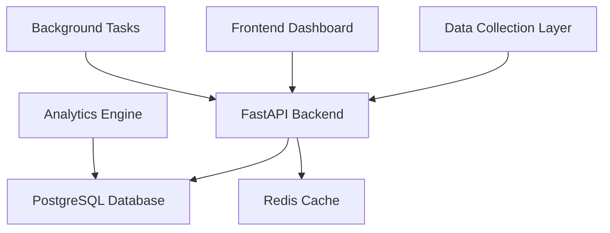

# Web Dashboard for Productivity Metrics - Complete Engineering Solution

[ACTION:BUILD]

I'll coordinate the development of a comprehensive productivity metrics dashboard. Based on the subtask analysis, here's the complete engineering solution:

## Product Requirements Document (Brief)

**Product**: Productivity Metrics Dashboard
**Goal**: Real-time tracking and visualization of daily/weekly productivity patterns
**Core Features**:
- Time distribution analysis with interactive charts
- Application usage breakdowns
- Focus time trend tracking
- Productive/unproductive hour identification
- Cross-platform data collection

## System Architecture Design



**Tech Stack**:
- **Backend**: FastAPI (performance) + Flask templates (rapid prototyping)
- **Database**: PostgreSQL with time-series optimization
- **Frontend**: React.js with Chart.js/D3.js
- **Infrastructure**: Docker, Nginx, Redis

## Implementation Plan

### Phase 1: Core Backend [ACTION:BUILD]

**File Structure**:
```
productivity_dashboard/
├── backend/
│   ├── app/
│   │   ├── models/          # Database schemas
│   │   ├── api/             # FastAPI endpoints
│   │   ├── services/        # Business logic
│   │   └── utils/           # Helper functions
│   ├── requirements.txt
│   └── main.py
├── frontend/
├── docker/
└── tests/
```

**Key Models**:
- `ActivitySession` (time tracking)
- `ApplicationUsage` (app monitoring)
- `ProductivityMetrics` (aggregated data)
- `User` (multi-user support)

### Phase 2: Frontend Dashboard [ACTION:BUILD]

**Core Components**:
- Time distribution pie/donut charts
- Focus time line graphs with trend analysis
- Application usage bar charts with filtering
- Heatmaps for productive hours
- Interactive date range selectors

### Phase 3: Data Pipeline [ACTION:BUILD]

**Collection Services**:
- Cross-platform activity monitoring
- Real-time data aggregation
- Background metric calculations
- Automated report generation

## Deployment Strategy [ACTION:DEPLOY]

**Infrastructure Components**:
- **Containerization**: Multi-stage Docker builds
- **Load Balancing**: Nginx reverse proxy
- **Database**: PostgreSQL with backup automation
- **Monitoring**: Prometheus + Grafana
- **CI/CD**: GitHub Actions pipeline

## Quality Assurance Plan

**Testing Strategy**:
- Unit tests for all API endpoints
- Integration tests for data pipeline
- Frontend component testing
- Performance testing for large datasets
- Cross-browser compatibility testing

## Next Steps for Engineering Team

1. **Coder**: Implement FastAPI backend with database models
2. **QA Tester**: Set up automated test suite and validation
3. **DevOps**: Configure Docker environment and deployment pipeline
4. **File Organizer**: Structure project directories and documentation

**Estimated Timeline**: 2-3 weeks for MVP, 1 additional week for production deployment

This solution provides a scalable, maintainable dashboard that can handle real-time productivity tracking with rich visualizations and cross-platform compatibility.